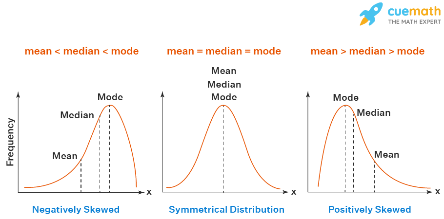

# Statistics-and-data-preparation

## In this part of data science and data mining training, the steps we will take are as follows

1. Introduction to statistics, probability and normal distribution
2. Probability distributions (normal, uniform, Bernoulli and binomial)
3. Probability distributions (polynomial, Poisson and exponential)
4. PDF, CDF and PMF functions and their application in probability distributions
5. Kullback-Leibler test for statistical distributions
6. Janson Shannon criterion for calculating two statistical distributions
7. Kolmogorov-Smirnov criterion for comparing probability distributions
8. Familiarity with P Value and its use in statistical tests
9. A-B statistical hypothesis testing session - practical example of changing the purchase page for customers

        

### Introduction to statistics, probability and normal distribution :

#### Installation
You already have NumPy and Pandas already installed, the `from scipy import stats` package is complet.

#### What is `stats` library ?
All of the statistics functions are located in the sub-package scipy.stats and a fairly complete listing of these functions can be obtained using info(stats). The list of the random variables available can also be obtained from the docstring for the stats sub-package.

For more information, you can check the following site:  
[scipy.stats Documentation](https://docs.scipy.org/doc/scipy/reference/stats.html#module-scipy.stats)

In this part, using the `stats.ipynb` file.
[stats.ipynb](https://github.com/schahinheidari/Statistics-and-data-preparation/blob/main/stats.ipynb)
#### Mode-Median-Mean:

### Probability distributions (normal, uniform, Bernoulli, binomial, polynomial, Poisson and exponential) :

#### Installation
You already have NumPy, Seaborn and Pandas already installed, the `from scipy import stats`, `from scipy.stats import norm` package is complet.

#### What did we do in this section?
In this section we used 
- [`stats.norm.rvs`](https://docs.scipy.org/doc/scipy/reference/generated/scipy.stats.norm.html), 
- [`stats.uniform.rvs`](https://numpy.org/doc/stable/reference/random/generated/numpy.random.uniform.html), 
- [`stats.bernoulli.rvs`](https://docs.scipy.org/doc/scipy/reference/generated/scipy.stats.bernoulli.html), 
- [`stats.binom.rvs`](https://docs.scipy.org/doc/scipy/reference/generated/scipy.stats.binom.html), 
- [`np.random.multinomial`](https://numpy.org/doc/stable/reference/random/generated/numpy.random.multinomial.html), 
- [`np.random.poisson`](https://numpy.org/doc/stable/reference/random/generated/numpy.random.poisson.html), 
- [`np.random.exponential`](https://numpy.org/doc/stable/reference/random/generated/numpy.random.exponential.html) And we used 
- [`sns.distplot`](https://pythonbasics.org/seaborn-distplot/) to display the data

In this part, using the `distributions.ipynb` file.
[distributions.ipynb](https://github.com/schahinheidari/Statistics-and-data-preparation/blob/main/distributions.ipynb)

### PDF, CDF and PMF functions and their application in probability distributions :

#### What is `PDF, CDF and PMF` ?
probability density function = PDF
cumulative density function = CDF 
probability mass function = PMF

For more information, you can check the following site:  
- [`PDF`](https://radzion.com/blog/probability/density), [`PDF information`](https://www.simplilearn.com/tutorials/statistics-tutorial/probability-density-function)
- [`CDF`](https://www.simplilearn.com/tutorials/statistics-tutorial/cumulative-distribution-function), [`CDF information`](https://campus.datacamp.com/courses/exploratory-data-analysis-in-python/distributions?ex=4)
- [`PMF`](https://www.kdnuggets.com/2019/05/probability-mass-density-functions.html), 

In this part, using the `PDF_CDF_PMF.ipynb` file.
[PDF_CDF_PMF.ipynb](https://github.com/schahinheidari/Statistics-and-data-preparation/blob/main/PDF_CDF_PMF.ipynb)

### Kullback-Leibler divergence test for statistical distributions :

#### What is `Kullback-Leibler` ?
**The Kullback-Leibler Divergence** score, or KL divergence score, quantifies how much one probability distribution differs from another probability distribution. KL divergence is the measure of the relative difference between two probability distributions for a given random variable or set of events. KL divergence is also known as Relative Entropy. 

For more information, you can check the following site:  
- [Kullback-Leibler wikipedia](https://en.wikipedia.org/wiki/Kullback%E2%80%93Leibler_divergence)
- [Kullback-Leibler Documentation](https://towardsdatascience.com/kl-divergence-python-example-b87069e4b810)

In this part, using the `Kullback-Leibler.ipynb` file.
[Kullback-Leibler.ipynb](https://github.com/schahinheidari/Statistics-and-data-preparation/blob/main/Kullback-Leibler/Kullback-Leibler.ipynb)

### Janson Shannon criterion for calculating two statistical distributions :

#### What is `Jenson Shanon` ?
**Jensen-Shannon Divergence** (JSD) measures the similarity between two distributions (i.e. the ground truth and the simulation). Another way to describe this metrics is the amount of divergence between two distributions.
The JSD is a symmetrized and smoothed version of the Kullback-Liebler Divergence, or D(p,q), which describes the divergence between probability distributions p and q. One important thing to note is that D is not symmetrical, in that D(p,q) does not equal D(q,p).

For more information, you can check the following site: 
- [JS Documentation](https://docs.scipy.org/doc/scipy/reference/generated/scipy.spatial.distance.jensenshannon.html)
- [JS wikipedia](https://en.wikipedia.org/wiki/Jensen%E2%80%93Shannon_divergence)

In this part, using the `JensonShanon.ipynb` file.
[JensonShanon.ipynb](https://github.com/schahinheidari/Statistics-and-data-preparation/blob/main/Jenson%20Shanon%20divergence/JensonShanon.ipynb)

### Kolmogorov-Smirnov criterion for comparing probability distributions :

#### What is `Kolmogorov-Smirnov` ?
**Kolmogorov–Smirnov test** a very efficient way to determine if two samples are significantly different from each other. It is usually used to check the uniformity of random numbers. Uniformity is one of the most important properties of any random number generator and Kolmogorov–Smirnov test can be used to test it. 
The Kolmogorov–Smirnov test may also be used to test whether two underlying one-dimensional probability distributions differ. It is a very efficient way to determine if two samples are significantly different from each other. 
**KS Test** is a very powerful way to automatically differentiate samples from a different distribution. kstest function may also be used to check whether the data given follows Normal Distribution or not. It compares the observed versus the expected cumulative relative frequencies of the Normal Distribution. The Kolmogorov-Smirnov test uses the maximal absolute difference between the observed and expected cumulative distribution.

For more information, you can check the following site:  
- [Kolmogorov-Smirnov wikipedia](https://en.wikipedia.org/wiki/Kolmogorov%E2%80%93Smirnov_test)
- [KS Documentation](https://docs.scipy.org/doc/scipy/reference/generated/scipy.stats.kstest.html)

In this part, using the `kolmogorov smirnov.ipynb` file.
[kolmogorov smirnov.ipynb](https://github.com/schahinheidari/Statistics-and-data-preparation/blob/main/kolmogorov%20smirnov/kolmogorov%20smirnov.ipynb)

### Familiarity with P Value and its use in statistical tests :

#### What is `P Value` or `A/B testing` ?
`A/B tests` are very commonly performed by data analysts and data scientists. It is important that you get some practice working with the difficulties of these. A/B testing is essentially an experiment where two or more variants of a page are shown to users at random, and statistical analysis is used to determine which variation performs better for a given conversion goal.
`A/B test` results can be complex to analyze. Even after creating a strong testing hypothesis, it only takes one simple mistake during the analysis process to derail your whole efforts and make you come up with conclusions that can cost you valuable leads and conversions. 

For more information, you can check the following site:  
- [A/B Testing in Python](https://python.plainenglish.io/a-b-testing-in-python-a-user-experience-research-methodology-2739297f8a23)
- [A/B testing Documentation](https://towardsdatascience.com/analyzing-a-b-test-results-with-python-code-b55fdcd8a78e)
- [AB_Tests Kaggle](https://www.kaggle.com/code/tammyrotem/ab-tests-with-python)

In this part, using the `P_Value.ipynb` file.
[P_Value.ipynb](https://github.com/schahinheidari/Statistics-and-data-preparation/blob/main/ABtest/P_Value.ipynb)

### A-B statistical hypothesis testing session - practical example of changing the purchase page for customers :

#### Installation
You already have NumPy and Pandas already installed. statsmodels is available through conda provided by Anaconda. The latest release can be installed using: `conda install -c conda-forge statsmodels` or To obtain the latest released version of statsmodels using pip:
`pip install statsmodels`

#### What is `statsmodels` library ?
statsmodels is a Python package that provides a complement to scipy for statistical computations including descriptive statistics and estimation and inference for statistical models. also we used `statsmodels.stats.proportion.proportions_ztest` in programming. 

For more information, you can check the following site:  
[statsmodels Documentation](https://pypi.org/project/statsmodels/)
[proportions_ztest Documentation](https://www.statsmodels.org/dev/generated/statsmodels.stats.proportion.proportions_ztest.html)

In this part, using the `A-B statistical hypothesis tests.ipynb` file.
[A-B statistical hypothesis tests.ipynb](https://github.com/schahinheidari/Statistics-and-data-preparation/blob/main/ABtest/A-B%20statistical%20hypothesis%20tests.ipynb)
